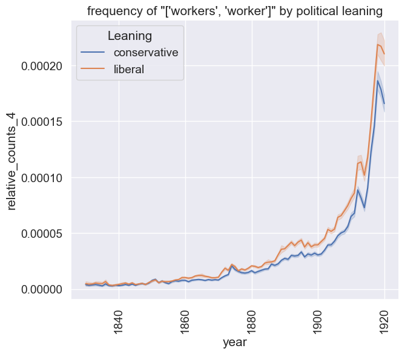

# NewsWords

NewsWords is a toolbox for studying the content of historical British Newspapers during the long nineteenth century.


Questions you answers with NewsWords are: Did Liberal newspaper talk more 'workers' about than Conservative titles? When and where did newspaper refer the 'droughts' or other environmental terms?

NewsWords is a toolbox build on two datasets
- NewsWords Word Count Data: records for each newspaper title the frequency of all words by month.
- Structured Press Directories: provides richer description of the press landscape. For each title, the press directories record import attributes such as politics, price and more!

By combining these sources, NewsWords enables you to study the distribution of words with high level of granulary and complexity. 

## Quick Tour

The most convenient way to explore NewsWords is by downloading the processed count data from [Zenodo](https://zenodo.org/uploads/14996278) and unzip `sparse_matrices.zip`.

After following the installation instructions, you open `Explore_Distributed_Corpus.ipynb` and follow the instructions. 

After opening the notebook, you need to set path to the location where you unzipped the data.
```python
path = 'path/to/data'
corpus = DistributedCorpus(path,n_cores=12)
```

Next you can define the `query_dict`. This is Python dictionary, which maps a query id to a list of query terms. 
By creating the query_dict you define all the query you want to run over the NewsWords corpus. The examples below, the first query will capture the frequency of the word 'machine', the second on the contains two words 'train' and 'railway'. Because it takes quite some time iterate over the complete dataset of 85GB, it is more efficient to define all query terms in advance.

```python
query_dict =  {1:['machine'],
               2:['train','railway'],
               3:['accident','accidents'],
               4:['workers','worker'],
               5:['drought','droughts']}
```               

Next, you can simply run the query using the following line of code.

```python
response = corpus.query(query_dict) # query the word count data
```

The `response` variable will contain a list of Pandas DataFames, one for each newspaper title. The first element of `response` records the how often the words in `query_dict` appear in newspaper with identifier. Please note that we record the frequency by month. 

By using the `add_context` you can add more context for each observation. This will add more columns with information about the political leaning, price and other attributes that are crucial to understanding the profile and position of each newspaper title.

```python
df = corpus.add_context(res) # add context to the query results
```

The resulting dataframe `df` contains
- the absolute and relative word counts for each query in `query_dict`
- the enriched metadata for each title

The allows you to study the distribution of words in the press in novel ways. For example the image below shows code for plotting timelines showing the relative frequency of the words 'worker(s)' in the Liberal and Conservative press.

Firstly you define the parameters of your search results.

```python
timestep = 'year' # define the time step, the temporal unit of analysis, mostly year
facet = 'Leaning'# define the facet 'Leaning'
facet_values = ['conservative','liberal'] # which labels to use as facet values
start_at, end_at = 1830,1920 # set the date range for the timeline
```

Secondly you can plot these results with the `seaborn` library. 

```python
plt.figure(figsize=(10,6))
plt.xticks(rotation=90)
plt.title(f'frequency of {str(query_dict[query_dict_key])}')
sns.set(font_scale= 1.25)
sns.lineplot(x=timestep,y=f'relative_counts_{query_dict_key}',data=df[time_filter])
```

Which generates the following lineplot.



## Installation

Create a new environment with the name newswords.

```bash
conda create -n newswords python=3.10
```

Active the newswords environment.

```bash
conda activate newswords
```

Install the ipykernel.

```bash
conda install -c anaconda ipykernel
```

Clone the newswords code and 

```bash
git clone https://github.com/Living-with-machines/newswords.git
cd ./newswords
```

Install all the necessary packages in the requirements file.

```bash
pip install -r requirements.txt
```

## Download


## Process
